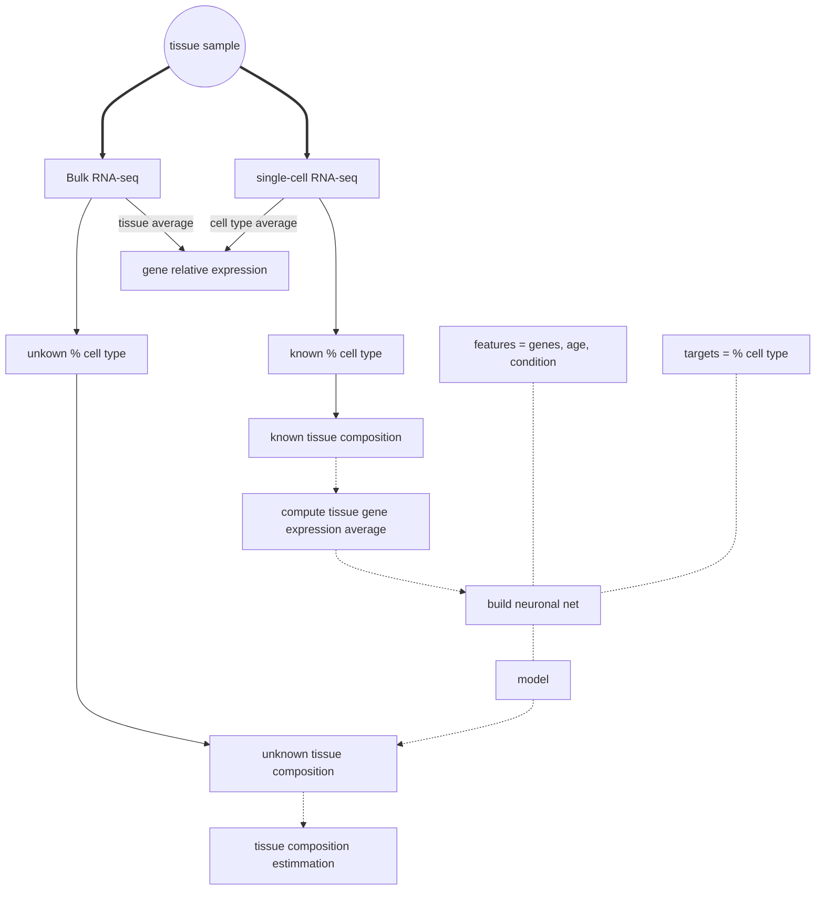

# In silico tissue stratification using machine learning  
**Authors:** Ana Añazco Guenkova and Leonardo Mendes-Silva

**Context:** Mini-project developed as part of [Summer School in Computational Biology](https://www.uc.pt/en/events/computationalbiology/) at the University of Coimbra in September 2023

## The challenge 
Biological samples, whether from healthy or diseased tissues, consist of varying proportions of distinct cell types. This cellular composition can strongly influence the identification of differentially expressed genes.  

In bulk RNA-seq, gene expression values represent an average across all cells within a sample, potentially masking differences between conditions or introducing bias when cell-type proportions differ. In contrast, single-cell RNA-seq allows gene expression profiling at the individual cell level, enabling the identification of expression changes specific to particular cell types.  

This challenge addresses two key problems:  
- **Reducing interpretation bias:** Estimating cell-type composition within bulk RNA-seq samples mitigates confounding effects due to varying cell populations when identifying differentially expressed genes.  
- **Optimizing sequencing costs:** Reliable cell-type composition prediction can reduce the need for expensive single-cell RNA-seq experiments by inferring this information directly from bulk data.  

## Data resources  
The project used publicly available data related to Huntington’s disease from the following studies:  

|publication | data source | GEO | Organism
|:-:|:-: |:-:|:-:|
|[Hodges et al 2006]([link](https://pubmed.ncbi.nlm.nih.gov/16467349/)) |bulk RNA (Affymetrix)  |[GSE3790](https://www.ncbi.nlm.nih.gov/geo/query/acc.cgi?acc=GSE3790) | *H. sapiens*|
|[Matsushima et al 2023]([link](https://pubmed.ncbi.nlm.nih.gov/36650127/)) |single-cells RNA-seq (Illumina) | [GSE152058](https://www.ncbi.nlm.nih.gov/geo/query/acc.cgi?acc=GSE152058) |*H. sapiens*

## Our approach
We proposed a **machine learning framework** to predict the percentage of each cell type within bulk RNA-seq samples.  

First, single-cell RNA-seq data were used to estimate cell-type proportions and calculate aggregated gene expression profiles representative of bulk data. These profiles were used as input features for model training, with the corresponding cell-type percentages serving as target variables.  

To address this task, we implemented a **neural network with two layers**, where the number of nodes matched the number of genes. The final layer used a `softmax()` activation to generate probability distributions for each cell type, ensuring that the predicted values summed to one. These probabilities represent the estimated percentage of each cell type within a given bulk tissue sample.  

The figure below summarizes the proposed approach, where solid lines represent the problem workflow and dashed lines indicate the proposed solution.  

------
## Learning outcomes  
This project provided hands-on experience in applying neural networks to biological data, focusing on model design, evaluation, and biological interpretation. It also reinforced the importance of integrating single-cell and bulk RNA-seq data to address biases in transcriptomic analyses.  

## Acknowledgements  
Developed during the *SSCB* course (2024) under the supervision of [prof. Matthias Futschik](https://github.com/MatthiasFutschik) and Sofia Torres(/fistorres).
